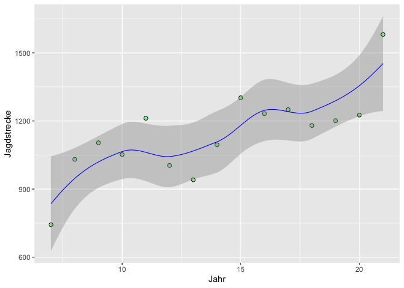
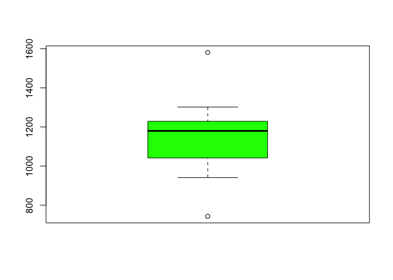

Jagdstrecke 2007 bis 2021
================

## Muffelwild [^1]

### Privatjagden

    ##    Jahr Jagdstrecke
    ## 1    21        1581
    ## 2    20        1226
    ## 3    19        1201
    ## 4    18        1180
    ## 5    17        1250
    ## 6    16        1232
    ## 7    15        1302
    ## 8    14        1095
    ## 9    13         941
    ## 10   12        1004
    ## 11   11        1212
    ## 12   10        1052
    ## 13    9        1104
    ## 14    8        1031
    ## 15    7         743

<!-- -->

<!-- -->

<!-- -->

### Fiskus

    ##    Jahr Strecke
    ## 1    21     244
    ## 2    20     242
    ## 3    19     209
    ## 4    18     252
    ## 5    17     226
    ## 6    16     203
    ## 7    15     615
    ## 8    14     215
    ## 9    13     215
    ## 10   12     244
    ## 11   11     231
    ## 12   10     281
    ## 13    9     235
    ## 14    8     239
    ## 15    7     198

<!-- -->

<!-- -->

<!-- -->

[^1]: Quelle: F. Herrmann LJV-Thüringen
