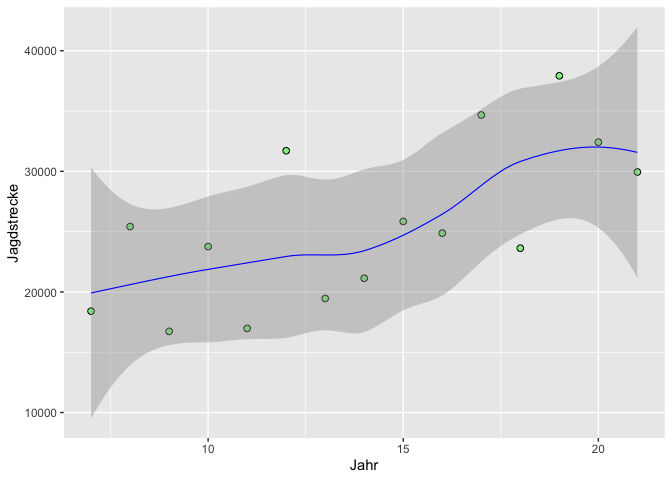
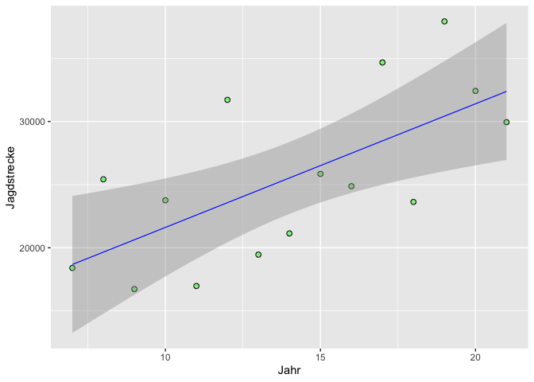
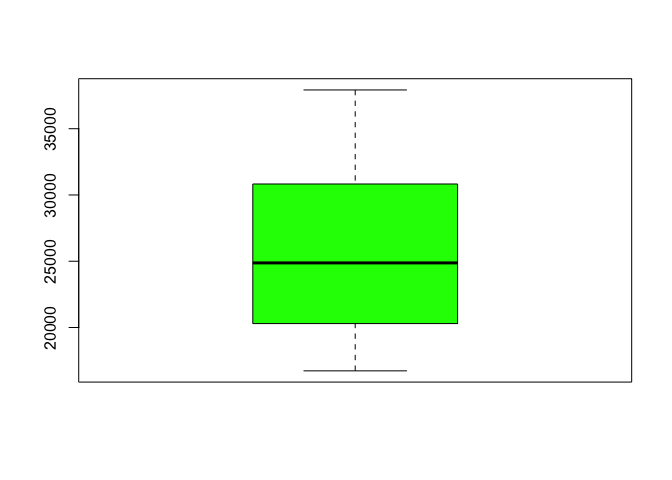
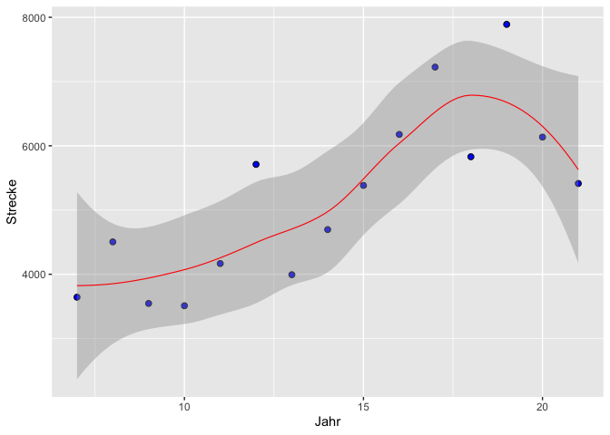
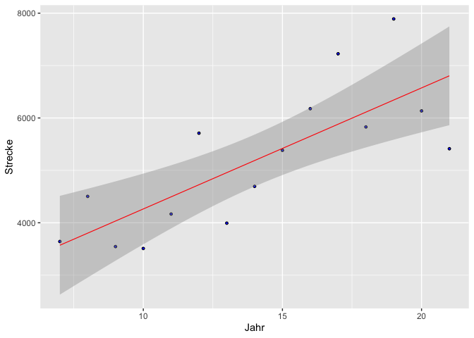
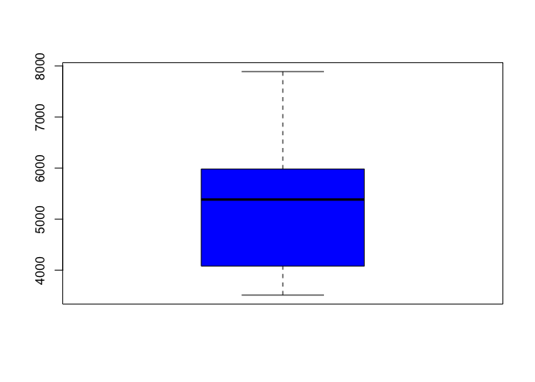
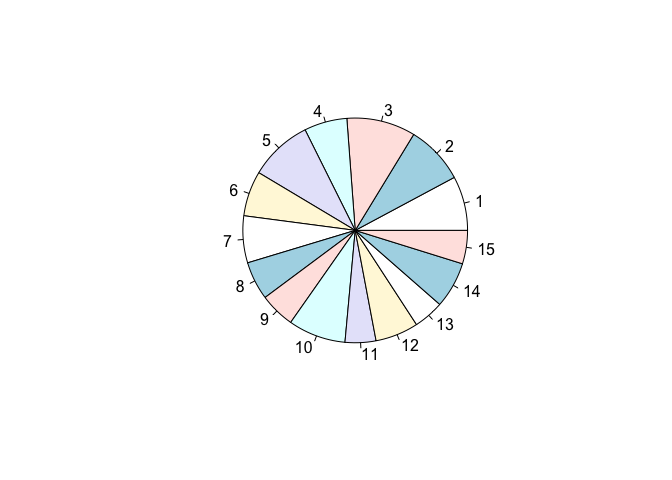

Jagdstrecke 2007 bis 2021
================

## Schwarzwild [^1]

### Privatjagden

    ##    Jahr Jagdstrecke
    ## 1    21       29945
    ## 2    20       32420
    ## 3    19       37924
    ## 4    18       23629
    ## 5    17       34672
    ## 6    16       24875
    ## 7    15       25849
    ## 8    14       21136
    ## 9    13       19457
    ## 10   12       31712
    ## 11   11       16974
    ## 12   10       23761
    ## 13    9       16730
    ## 14    8       25422
    ## 15    7       18403

<!-- -->

<!-- -->

<!-- -->

### Fiskus

    ##    Jahr Strecke
    ## 1    21    5413
    ## 2    20    6135
    ## 3    19    7890
    ## 4    18    5829
    ## 5    17    7225
    ## 6    16    6177
    ## 7    15    5383
    ## 8    14    4695
    ## 9    13    3993
    ## 10   12    5710
    ## 11   11    4167
    ## 12   10    3510
    ## 13    9    3546
    ## 14    8    4504
    ## 15    7    3643

<!-- -->

<!-- -->

<!-- -->

``` r
library(ggplot2)
pie(df2$Jagdstrecke1)
```

<!-- -->

[^1]: Quelle: F. Herrmann LJV-Thüringen
