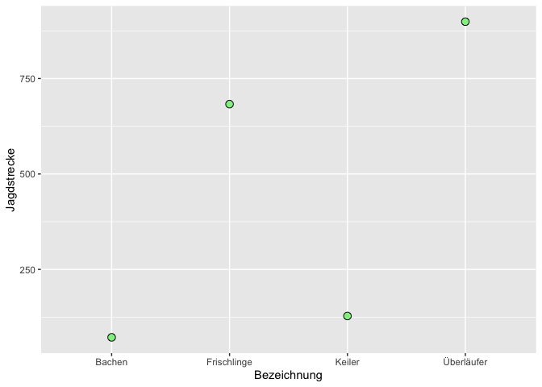
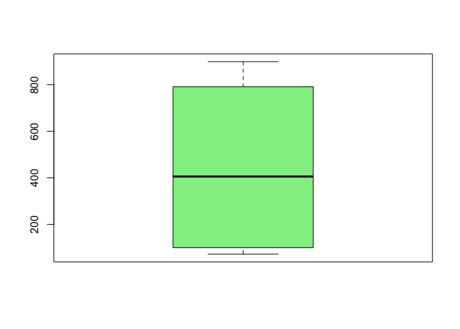

Schwarzwild KYF
================

    ##   Bezeichnung Jagdstrecke
    ## 1      Keiler         128
    ## 2      Bachen          72
    ## 3  Überläufer         899
    ## 4 Frischlinge         683

$$
\sum Jagdstrecke
$$

    ## Gesamtstrecke

    ## [1] 1782

``` r
library(ggplot2)
ggplot(d7, aes(Bezeichnung, Jagdstrecke)) +
  geom_point(shape = 21, size = 3, fill = "lightgreen") 
```

<!-- -->

``` r
boxplot(d7$Jagdstrecke, col="lightgreen")
```

<!-- -->
