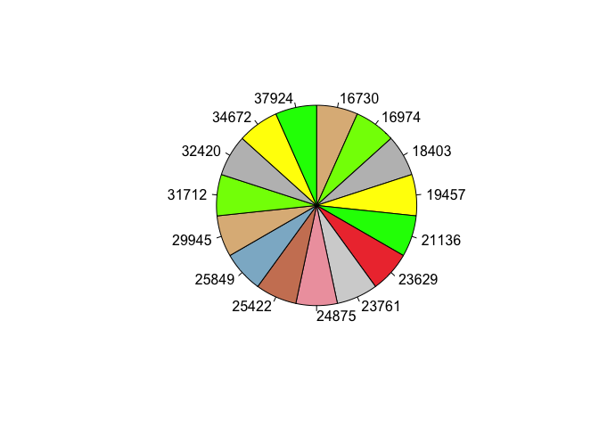
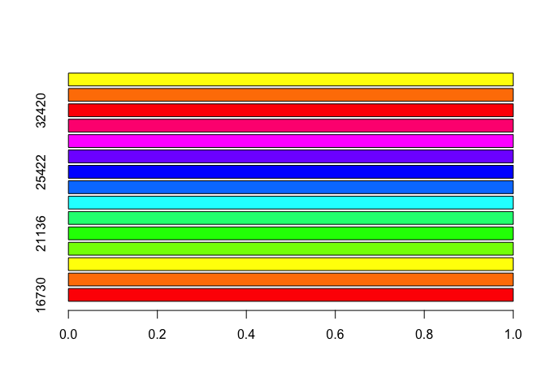

Untitled
================

    ##    Jagdstrecke1 Jahr1
    ## 1         29945    21
    ## 2         32420    20
    ## 3         37924    19
    ## 4         23629    18
    ## 5         34672    17
    ## 6         24875    16
    ## 7         25849    15
    ## 8         21136    14
    ## 9         19457    13
    ## 10        31712    12
    ## 11        16974    11
    ## 12        23761    10
    ## 13        16730     9
    ## 14        25422     8
    ## 15        18403     7

``` r
library(ggplot2)
pie(table(df2$Jagdstrecke1), clockwise=TRUE, col=c("burlywood", "chartreuse", "grey", "yellow", "green", "brown2", "lightgrey", "lightpink2", "lightsalmon3", "lightskyblue3"))
```

<!-- -->

``` r
barplot(table(df2$Jagdstrecke1),
horiz=TRUE,
col=rainbow(12),
# Legende aus Faktorenlevels
legend.text = levels(df2$Jahr1))
```

<!-- -->
